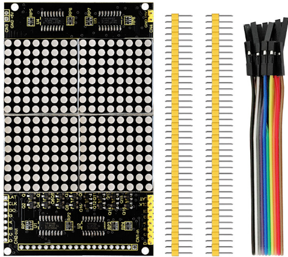
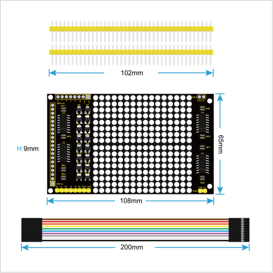
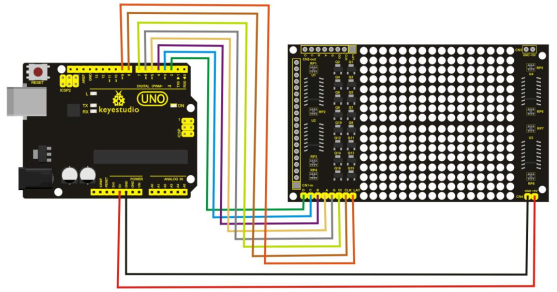
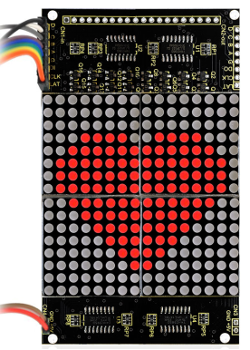

# KS0262 keyestudio LED Dot Matrix Display Module 1616 Infinite Cascade



## 1. Introduction

Keyestudio LED dot matrix display module connects four 8 * 8 dot matrix. Line selection is chosen by 4-16 decoder which consists of two 74HC138, and as for the strobe line, LED anode will be connected. Column output consists of two 74HC595 cascades, which can convert serial data into parallel data through the SPI signal.

When a column’s output signal is a high level, LED cathode on the column is also a high level, so that the LED located in intersection of the selected line and column doesn’t light up.

On the contrary, when the column’s output signal is a low level, the LED cathode on the column is also a low level, so that the LED located in intersection of the selected line and column will light up.

After passing a row, 74HC595 outputs the line data. A total of 16 lines cycle in turn with dynamic scanning, which can make 16 * 16 dot matrix show the required text or graphics.

## 2. Performance Parameters

- Supply Voltage: DC 5V
- Compatible with LCD12864 interface, once plug and play;
- Rich routines,provided with 51 single-chip and Arduino routines.



## 3. Connection Diagram



## 4. Sample Code

Download code : [Code](./Code.7z)

```c
#include <Arduino.h>
#define LEDARRAY_D 2
#define LEDARRAY_C 3
#define LEDARRAY_B 4
#define LEDARRAY_A 5
#define LEDARRAY_G 6
#define LEDARRAY_DI 7
#define LEDARRAY_CLK 8
#define LEDARRAY_LAT 9

unsigned char Display_Buffer[2];
const unsigned char  Word1[1][32] = 
{
0xFF,0xFF,0xFF,0xE1,0xC0,0x80,0x80,0x80,0xC0,0xE0,0xF0,0xF8,0xFC,0xFE,0xFF,0xFF,
0xFF,0xFF,0xFF,0x87,0x03,0x01,0x01,0x01,0x03,0x07,0x0F,0x1F,0x3F,0x7F,0xFF,0xFF,/*"C:\Users\Lin\Desktop\心.BMP",0*/
};

const unsigned char  Word2[1][32] = 
{
0xFF,0xF8,0xF0,0xE0,0xC0,0x87,0x86,0x84,0x85,0x86,0x87,0xC0,0xE0,0xF0,0xF8,0xFF,
0xFF,0x1F,0x0F,0x07,0x03,0xE1,0x61,0xA1,0x21,0x61,0xE1,0x03,0x07,0x0F,0x1F,0xFF,/*"Unnamed file",0*/
};

void setup()
{
  pinMode(LEDARRAY_D, OUTPUT); 
  pinMode(LEDARRAY_C, OUTPUT);
  pinMode(LEDARRAY_B, OUTPUT);
  pinMode(LEDARRAY_A, OUTPUT);
  pinMode(LEDARRAY_G, OUTPUT);
  pinMode(LEDARRAY_DI, OUTPUT);
  pinMode(LEDARRAY_CLK, OUTPUT);
  pinMode(LEDARRAY_LAT, OUTPUT);
}

void loop()
{
  int a=300, i=300;
  while(i)
  {
  Display(Word1);
  i--;
  }
  delay(100);
    while(a)
  {
  Display(Word2);
  a--;
  }
  delay(100);
}

//************************************************************
//num means the number of word  dat[][32] is the name of font
//*************************************************************
void Display(const unsigned char dat[][32])         
{
  unsigned char i;
  for( i = 0 ; i < 16 ; i++ )
  {
    digitalWrite(LEDARRAY_G, HIGH);   //When updating the data,please close the display. After updating the data, open the 138 display line. Avoiding ghosting.

    Display_Buffer[0] = dat[0][i];    
    Display_Buffer[1] = dat[0][i+16];

    Send(Display_Buffer[1]);
    Send(Display_Buffer[0]);

    digitalWrite(LEDARRAY_LAT, HIGH);         //storage data  
    delayMicroseconds(1);

    digitalWrite(LEDARRAY_LAT, LOW);
    delayMicroseconds(1);

    Scan_Line(i);             //Choose the line i

    digitalWrite(LEDARRAY_G, LOW);

    delayMicroseconds(100);;      // Delay for a period of time to let the LED light up.          
  } 
}

//****************************************************
//Scanning line
//****************************************************
void Scan_Line( unsigned char m)
{ 
  switch(m)
  {
    case 0:     
      digitalWrite(LEDARRAY_D, LOW);digitalWrite(LEDARRAY_C,LOW);  	 
      digitalWrite(LEDARRAY_B, LOW);digitalWrite(LEDARRAY_A, LOW); 
      break;
    case 1:         
      digitalWrite(LEDARRAY_D, LOW);digitalWrite(LEDARRAY_C, LOW);
      digitalWrite(LEDARRAY_B, LOW);digitalWrite(LEDARRAY_A, HIGH);     
      break;
    case 2:         
      digitalWrite(LEDARRAY_D, LOW);digitalWrite(LEDARRAY_C, LOW);
      digitalWrite(LEDARRAY_B, HIGH);digitalWrite(LEDARRAY_A, LOW);     
      break;
    case 3:         
      digitalWrite(LEDARRAY_D, LOW);digitalWrite(LEDARRAY_C, LOW);
      digitalWrite(LEDARRAY_B, HIGH);digitalWrite(LEDARRAY_A, HIGH);    
      break;
    case 4:
      digitalWrite(LEDARRAY_D, LOW);digitalWrite(LEDARRAY_C, HIGH);digitalWrite(LEDARRAY_B, LOW);digitalWrite(LEDARRAY_A, LOW);     
      break;
    case 5:
      digitalWrite(LEDARRAY_D, LOW);digitalWrite(LEDARRAY_C, HIGH);digitalWrite(LEDARRAY_B, LOW);digitalWrite(LEDARRAY_A, HIGH);    
      break;
    case 6:
      digitalWrite(LEDARRAY_D, LOW);digitalWrite(LEDARRAY_C, HIGH);digitalWrite(LEDARRAY_B, HIGH);digitalWrite(LEDARRAY_A, LOW);    
      break;
    case 7:
      digitalWrite(LEDARRAY_D, LOW);digitalWrite(LEDARRAY_C, HIGH);
      digitalWrite(LEDARRAY_B, HIGH);digitalWrite(LEDARRAY_A, HIGH);     
      break;
    case 8:
      digitalWrite(LEDARRAY_D, HIGH);digitalWrite(LEDARRAY_C, LOW);
      digitalWrite(LEDARRAY_B, LOW);digitalWrite(LEDARRAY_A, LOW);     
      break;
    case 9:
      digitalWrite(LEDARRAY_D, HIGH);digitalWrite(LEDARRAY_C, LOW);d
      igitalWrite(LEDARRAY_B, LOW);digitalWrite(LEDARRAY_A, HIGH);    
      break;  
    case 10:
      digitalWrite(LEDARRAY_D, HIGH);digitalWrite(LEDARRAY_C, LOW);
      digitalWrite(LEDARRAY_B, HIGH);digitalWrite(LEDARRAY_A, LOW);    
      break;
    case 11:
      digitalWrite(LEDARRAY_D, HIGH);digitalWrite(LEDARRAY_C, LOW);digitalWrite(LEDARRAY_B, HIGH);digitalWrite(LEDARRAY_A, HIGH);     
      break;
    case 12:
      digitalWrite(LEDARRAY_D, HIGH);digitalWrite(LEDARRAY_C, HIGH);digitalWrite(LEDARRAY_B, LOW);digitalWrite(LEDARRAY_A, LOW);    
      break;
    case 13:
      digitalWrite(LEDARRAY_D, HIGH);digitalWrite(LEDARRAY_C, HIGH);
      digitalWrite(LEDARRAY_B, LOW);digitalWrite(LEDARRAY_A, HIGH);     
      break;
    case 14:
      digitalWrite(LEDARRAY_D, HIGH);digitalWrite(LEDARRAY_C, HIGH);digitalWrite(LEDARRAY_B, HIGH);digitalWrite(LEDARRAY_A, LOW);     
      break;
    case 15:
      digitalWrite(LEDARRAY_D, HIGH);digitalWrite(LEDARRAY_C, HIGH);
      digitalWrite(LEDARRAY_B, HIGH);digitalWrite(LEDARRAY_A, HIGH);    
      break;
    default : break;  
  }
}

//****************************************************
//Send the data      
//****************************************************
void Send( unsigned char dat)
{
  unsigned char i;
  digitalWrite(LEDARRAY_CLK, LOW);
  delayMicroseconds(1);;  
  digitalWrite(LEDARRAY_LAT, LOW);
  delayMicroseconds(1);;

  for( i = 0 ; i < 8 ; i++ )
  {
    if( dat&0x01 )
    {
      digitalWrite(LEDARRAY_DI, HIGH);  
    }
    else
    {
      digitalWrite(LEDARRAY_DI, LOW);
    }
    delayMicroseconds(1);
    digitalWrite(LEDARRAY_CLK, HIGH);       // Rising edge sends the data 
    delayMicroseconds(1);
    digitalWrite(LEDARRAY_CLK, LOW);
    delayMicroseconds(1);   
    dat >>= 1;
  }     
}
```

## 5. Result

Wiring as the above diagram, after powered-on, dot matrix screen shows the pattern below.

